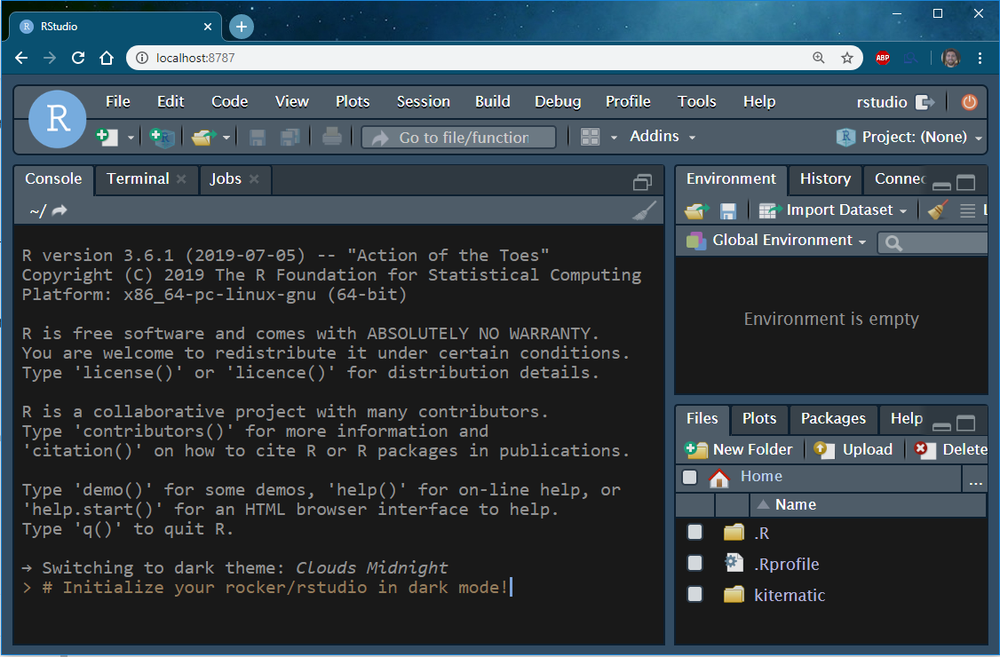

# native_dark_rstudio

<!-- badges: start -->
<!-- badges: end -->

This repo has the R, dockerfile and supporting script to make the most basic rocker/rstudio docker image by default theme as "Clouds Midnight".

Process:

- edit add_themes.R to change your default theme.
  - themes supported include the native themes in rstudio and any of the default rsthemes.
  
- run the code within "native_dark_rstudio"
  - this will generate the dockerfile, and eventually build the docker image that has the theme
  - it can take some time to build everything, so be patient!
  - you can ignore and use the base dockerfile with this repo if you are comfortable editing those
  
- start your docker container with:
 ` docker run --rm -p 8787:8787 -e PASSWORD=testpass --name my_rstudio_instance theme_rstudio`
 
- enjoy!

- kill the docker container with:
 ` docker kill my_rstudio_instance`

